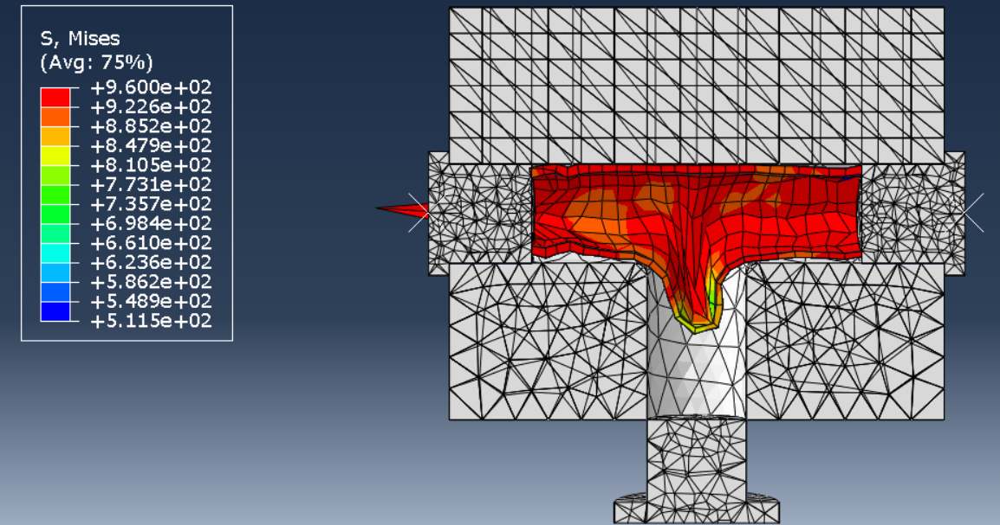
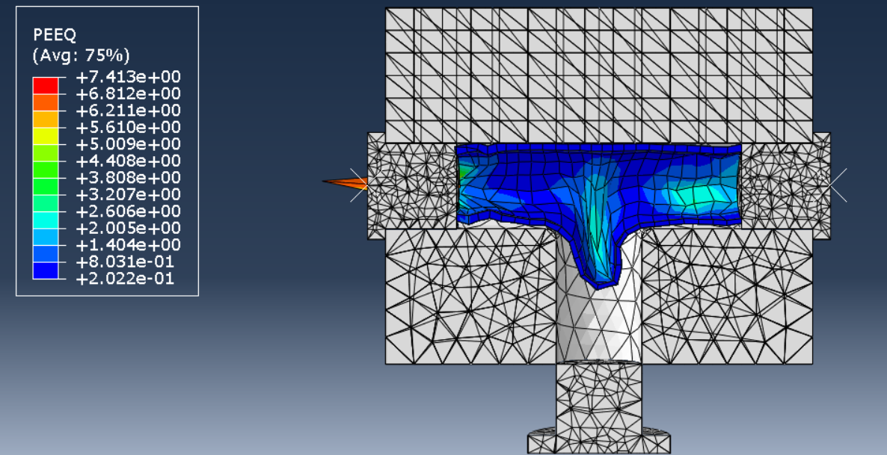
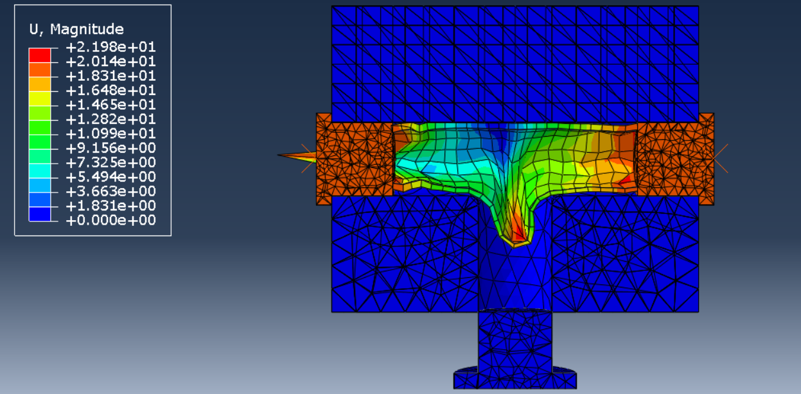

# FEA Simulation Analysis of Tube Hydroforming Process

## 📌 Project Overview
This project investigates the **Tube Hydroforming process** using **Finite Element Analysis (FEA)**.  
Hydroforming is a modern metal forming technique where **pressurized fluid** and **axial forces** are used to shape tubes into complex geometries. It is widely used in **automotive** and **aerospace industries** due to its ability to produce **lightweight, seamless, and high-strength hollow parts**.

The study includes:
- **CAD modeling** of the tube and die setup in **SolidWorks**.
- **FEA simulation** of the forming process using **Abaqus/Explicit**.
- Analysis of **stress, strain, displacement, and thickness distribution** in the final part.

---

## 🎯 Objectives
- Model the **tube-die assembly** for a T-branch hydroforming process.
- Study the **effect of internal pressure, axial feed, and friction** on deformation.
- Evaluate **stress and strain distribution** during plastic deformation.
- Identify **failure risks** such as bursting, wrinkling, or excessive thinning.
- Validate how **FEA simulation reflects plasticity and metal forming theories**.

---

## 🛠 Tools & Software
- **SolidWorks** – CAD design of tube, dies, and plungers.  
- **Abaqus/Explicit** – Nonlinear FEA simulation of the forming process.  
- **Material** – Inconel 718 (high-strength nickel-based superalloy).  

---

## 📐 Methodology
1. **Geometric Modeling (SolidWorks)**  
   - Designed tube, upper/lower dies, axial plungers, and counter plunger.  
   - Exported models in **STEP/IGES** format for Abaqus import.  

2. **FEA Simulation (Abaqus)**  
   - Defined materials: rigid bodies for dies & plungers; plastic Inconel 718 for tube.  
   - Applied **internal hydraulic pressure** + **axial feeding displacement**.  
   - Defined **surface-to-surface contact** with friction.  
   - Meshed tube with **tetrahedral and brick elements** for accuracy.  
   - Simulated using **Dynamic Explicit** solver.  

3. **Post-Processing**  
   - Evaluated **stress (Von Mises, S11–S33, shear stresses)**.  
   - Monitored **plastic strain (PEEQ)** and **principal strains**.  
   - Analyzed **displacement, velocity, acceleration, and contact pressure**.  

---

## 📊 Results
- Tube successfully expanded into **T-branch cavity** without rupture.  
- **Thickness distribution** remained within acceptable limits.  
- **Stress concentration** occurred near branch intersection.  
- **Plastic strain localization** was observed at high-deformation zones.  
- Results validated key concepts of **plasticity and metal forming**:
  - Transition from elastic → plastic region.  
  - Strain localization at geometric discontinuities.  
  - Influence of combined **axial load + internal pressure**.  

---

## 📂 Repository Structure
├── Report.pdf # Full project report

├── solidworks_model/ # CAD files of tube, dies, plungers

├── abaqus_simulation/ # Abaqus CAE/ODB files

├── images/ # Screenshots of results (stress, strain, deformation)

└── README.md # This file

---

## 🔬 Applications
- **Automotive industry**: Lightweight exhausts, chassis parts.  
- **Aerospace industry**: High-strength hollow structural components.  
- **Metal forming research**: Validation of plasticity theory.  

---

## 👨‍🎓 Authors
- **Mohammad Mahdi Khademi**  
- **Negar Naghavian**  

**Supervised by:** Dr. Ramin Hashemi  
**Course:** Plasticity and Metal Forming  

## 📸 Simulation Results

### Stress Distribution (Von Mises)

### Plastic Strain (PEEQ)

### Final Deformed Shape

---

## 📖 References
- Sreenivasulu, B., & Prasanthi, G. (2014). *FEA Simulation Analysis of Tube Hydroforming Process using DEFORM-3D*. Procedia Engineering, 97, 1187–1197.  

